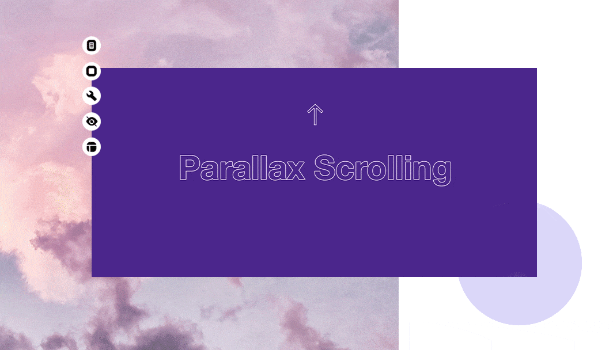

# A-Fairy-Tale-City-Mardin (Parallax Website)

## Description
Project aims to create parallax website.

## Project Skeleton 

```
mardin-city-website (folder)
|
|----readme.md        
|----im
|----index.html  
|----style.css   
```

## Expected Outcome



### At the end of the project, following topics are to be covered;

- HTML 

- List Properties

- Overflow Property-Display Property-The float Property-Opacity / Transparency-Units in CSS

- CSS Setting height and width-CSS Outline-CSS Combinators

- improved coding skills within HTML & CSS

- used git commands (push, pull, commit, add etc.) and Github as Version Control System.

<p align='center'> ⌛ Happy Coding ✍ - Please feel free to check my work ! 🙃 </p>